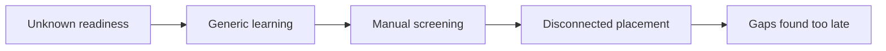
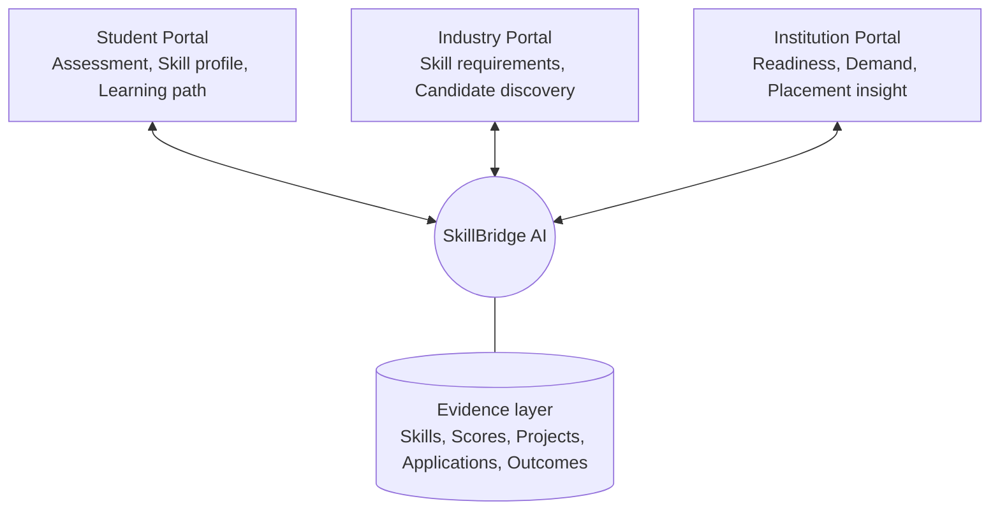
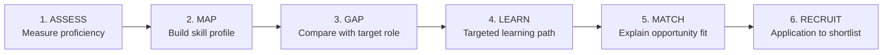
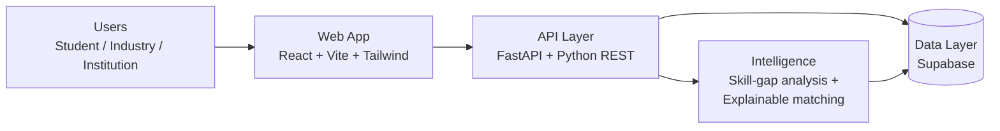

# SkillBridge AI

**Bridging Skills • Learning • Opportunities • Placement**

A unified portal that turns skill evidence into learning paths, opportunities and placement insight, connecting students, industry and institutions.

**Team Apex** | Problem Statement **SIH26044** | Theme: Smart Automation | Category: Software

> Problem: *Portal for Academia–Industry Collaboration for Skill Mapping, Internships and Placement*

---

## Table of Contents

1. [Problem](#problem)
2. [Our Solution](#our-solution)
3. [How It Works](#how-it-works)
4. [Key Features](#key-features)
5. [System Architecture](#system-architecture)
6. [Tech Stack](#tech-stack)
7. [MVP Results](#mvp-results)
8. [Feasibility and Viability](#feasibility-and-viability)
9. [Impact](#impact)
10. [Getting Started](#getting-started)
11. [Project Structure](#project-structure)
12. [Roadmap](#roadmap)
13. [References](#references)
14. [Team](#team)

---

## Problem

Assessment, learning and placement usually run as separate workflows. This leaves three groups without what they need:

| Who | Pain point |
|---|---|
| **Students** | Unclear job-readiness and no clear next step |
| **Industry** | Hard to find candidates with role-specific skills; manual screening is noisy |
| **Institutions** | No visibility into placement gaps before recruitment begins |



## Our Solution

SkillBridge AI builds **one measurable skill profile** and reuses it across assessment, learning, opportunity matching and recruitment. Recommendations are **explainable**: users see matched, developing and missing skills instead of a single opaque score.

Three portals work on shared evidence:



## How It Works



1. **Assess**: the student takes a structured assessment (25 questions in the demo).
2. **Map**: results become a structured skill profile.
3. **Gap**: the profile is compared with the skills a target role requires.
4. **Learn**: a role-based learning path targets the missing skills.
5. **Match**: opportunities are ranked and the reasons for the fit are shown.
6. **Recruit**: applications are tracked through to shortlisting.

## Key Features

- **Skill assessment**: measures current proficiency.
- **Skill profile**: structured profile per student, validated by institutions and recruiters.
- **Skill-gap analysis**: compares skills against a target role.
- **Role-based learning path**: targeted learning instead of generic courses.
- **Eligibility check**: shows readiness before applying.
- **Explainable matching**: matched, developing and missing skills for each opportunity.
- **Recruitment pipeline**: track application to shortlist.
- **Institution analytics**: readiness and demand insight for placement cells.

## System Architecture



| Layer | Responsibility |
|---|---|
| User layer | Student, industry and institution workflows |
| Web app | React interface for all three portals |
| API layer | FastAPI REST services for assessment, matching and recruitment |
| Data layer | Supabase storing skills, jobs, applications and analytics |
| Insight | Skill gap, match, readiness and analytics outputs |

## Tech Stack

| Area | Technology |
|---|---|
| Frontend | React, Vite, Tailwind CSS |
| Backend | FastAPI, Python |
| Database | Supabase |
| Intelligence | Skill-gap analysis and explainable matching |
| Deployment | Cloud-ready, modular architecture |

## MVP Results

Results from the working demo:

| Metric | Result |
|---|---|
| Assessment | 25 questions, **60%** score |
| Python proficiency | **50% to 80%** after targeted learning |
| Career readiness | **83%** |
| Best opportunity match | **91.66%** |
| Candidates shortlisted | **1** |

## Feasibility and Viability

- **Standard infrastructure**: web and cloud only, no specialized hardware.
- **Modular design**: frontend, APIs and data services can evolve independently.
- **Data persistence**: skills, opportunities, applications and analytics are stored for repeatable workflows.
- **Human-in-the-loop**: institutions and recruiters can validate profiles and update requirements.
- **Rollout model**: pilot with a limited set of institutions and employers, validate outcomes, then expand.

| Risk | Mitigation |
|---|---|
| Skill data quality | Structured assessment and verified profiles |
| Changing industry demand | Recruiter-controlled requirements |
| Trust in AI | Evidence shown behind every recommendation |
| Integration | Modular APIs and persistent data |

## Impact

- **Students**: clear direction and targeted learning.
- **Industry**: better skill-fit and less screening noise.
- **Institutions**: readiness and demand insight for placement planning.
- **Overall**: employability, transparency, productivity and scalability.

## Getting Started

> Adjust folder names and commands below to match this repository.

### Prerequisites

- Node.js 18+
- Python 3.10+
- A Supabase project (URL and anon key)

### 1. Clone

```bash
git clone https://github.com/<your-username>/<your-repo>.git
cd <your-repo>
```

### 2. Backend

```bash
cd backend
python -m venv venv
source venv/bin/activate        # Windows: venv\Scripts\activate
pip install -r requirements.txt
cp .env.example .env            # add your Supabase credentials
uvicorn main:app --reload
```

### 3. Frontend

```bash
cd frontend
npm install
cp .env.example .env            # add API URL and Supabase keys
npm run dev
```

The app runs at `http://localhost:5173` and the API docs at `http://localhost:8000/docs`.

## Project Structure

```
.
├── frontend/     # React + Vite + Tailwind web app
├── backend/      # FastAPI services (assessment, matching, recruitment)
├── docs/         # Presentation and supporting material
└── README.md
```

## Roadmap

- Pilot with a small set of institutions and employers
- Validate placement outcomes
- Extend to more institutions, employers and roles
- Add historical placement datasets for stronger demand insight

## References

- **Smart India Hackathon 2026**: Problem Statement SIH26044
- **AICTE National Internship Portal**: reference ecosystem for verified opportunities and student–industry links
- **NEP 2020 (Ministry of Education)**: policy direction for industry-aligned education and experiential learning

## Team

**Team Apex**

| Name | Role |
|---|---|
| _Add member_ | _Add role_ |
| _Add member_ | _Add role_ |

## Links

- Presentation: _add link_
- Demo video: _add link_
- Live demo: _add link_
